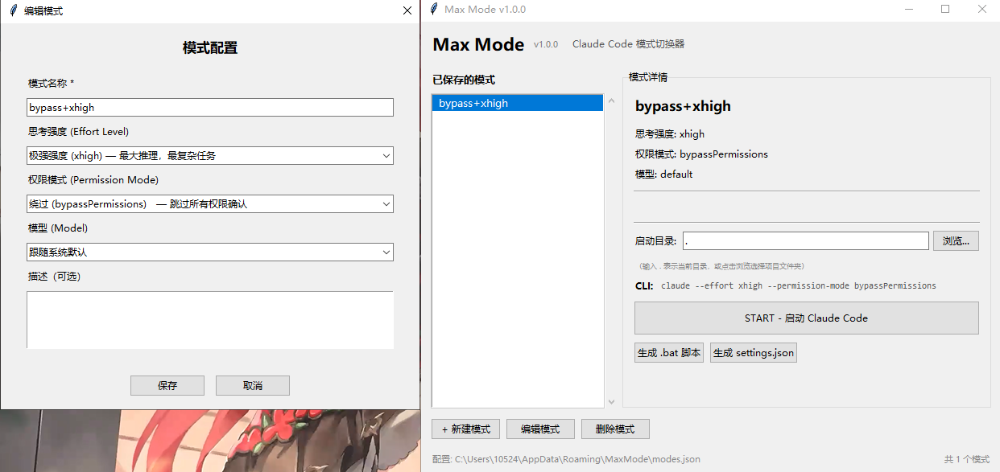

# Max Mode — DeepSeek 配置启动器

一个 Windows 桌面工具，专为 **DeepSeek** 的接入使用而打造。为 DeepSeek 创建和管理不同的运行模式，每个模式绑定不同的**思考强度**、**权限级别**和**模型**，一键生成启动脚本。



## 为什么选择 Max Mode？

DeepSeek 提供了多款模型（`deepseek-v4-pro`、`deepseek-chat`、`deepseek-reasoner` 等），每种模型适合不同场景。Max Mode 让你在它们之间秒切，同时控制权限和推理深度，免去每次手动敲 CLI 参数的麻烦。

## 功能

- 🎛 **自定义模式** — 自由组合思考强度（low/medium/high/xhigh）+ 权限模式（default/acceptEdits/bypass/plan）+ DeepSeek 模型
- ⚡ **生成启动脚本** — 为每个模式生成独立的 `.bat` 批处理文件，双击即可启动 DeepSeek
- ⚙ **生成项目配置** — 直接为项目生成 `.claude/settings.json`，在项目中自动应用模式
- 💾 **持久化存储** — 模式配置保存在 `%APPDATA%/MaxMode/modes.json`

## 支持的模式组合

| 维度 | 可选值 |
|------|--------|
| 思考强度 | low · medium · high · xhigh |
| 权限模式 | acceptEdits · default · auto · bypassPermissions · plan |
| 模型 | default · deepseek-v4-pro · deepseek-chat · deepseek-reasoner |

> 模型、思考强度和权限可任意组合，每个组合保存为一个"模式"，点击即可启动。

## 运行

```bash
# 直接运行（需要 Python 3.8+）
python run.py

# 打包为 EXE（需要 PyInstaller）
pip install pyinstaller
python build_exe.py

# 生成的 EXE 在 dist/MaxMode.exe
```

## 使用

1. 点击 **新建模式** 创建 DeepSeek 运行配置
2. 在列表中选择一个模式，右侧会预览完整的 CLI 参数
3. 点击 **生成启动脚本** 创建 `.bat` 文件到桌面
4. 双击 `.bat` 以对应模式启动 DeepSeek
5. 也可以点击 **START** 按钮直接从工具中启动

## 依赖

- Python 3.8+（仅开发/运行源码时需要）
- tkinter（Python 标准库自带）
- PyInstaller（仅打包时需要）
